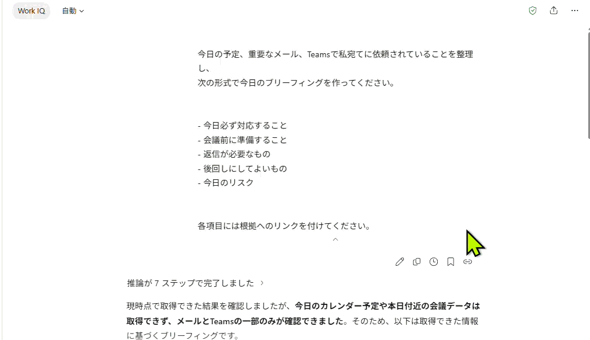

# 自分専用の「鉄板プロンプト」を作る｜CHAT-17

<!--
統合メモ（Pages には表示されません）
本ファイルは「朝または夕方のプロンプトを定型化する｜CHAT-12」を CHAT-17 に統合したものです。
CHAT-12 の単独ファイルは廃止し、リンク元は本ファイルに差し替えてください。
-->

| 項目 | 内容 |
|---|---|
| **目的** | 日常的に使うプロンプトを 5 本に絞り、毎日繰り返し使える形に整えて、いつでも呼び出せる状態にする |
| **所要** | 約 20 分（目安） |
| **利用** | Microsoft Copilot Chat（Work）（Prompt Gallery への保存／利用可能な環境ではスケジュール実行） |
| **入力** | これまでの依頼内容と、役に立った回答 |
| **成果** | 自分専用プロンプト 5 本（使うタイミング／必要な入力／完成版／注意点）＋ 日付に依存しない定型版 1 本と、その保存 s4|

> **実施条件**：Microsoft Copilot のライセンスがあり、自分のメール・会議・ファイルにアクセスできる場合にハンズオンで実施します。
> そうでない場合は、ファシリテーターのデモを見ながら進めてください。

---

## シナリオ

30 日のうち、後半で価値が出るのは新しい機能ではなく **自分の鉄板プロンプト** です。

これまでの依頼と役に立った回答を踏まえ、日常的に使う 5 本を作ります。ただし、作って終わりにはしません。5 本のうち **いちばん効いた 1 本を、日付に依存しない定型プロンプトに作り替え、保存して呼び出せる状態**にするところまでを、今日のゴールにします。

定型化の対象としては、[忙しい朝を3分で整理する｜CHAT-07](./CHAT-07_忙しい朝を3分で整理する.md) や [1日の終わりをCopilotで締める｜CHAT-13](./CHAT-13_1日の終わりをCopilotで締める.md) のように、毎日同じタイミングで使えるものが選びやすいです。

> 進行役の説明例：「30 個の機能を覚える必要はありません。5 本すべてを使う必要もありません。毎日使う 1 本が決まれば成功です。」

---

## TRY — 手順

### ステップ 1 — 鉄板プロンプトを 5 本作る

1. Copilot Chat を開く
2. **Work IQ** がオンであることを確認する
3. プロンプト ボックスをクリックする
4. 次のプロンプトを貼り付ける

```text
私の日常業務やCopilotの利用傾向を参考に、
繰り返し利用すると効果が高いプロンプトを5つ提案してください。

以下の表形式で出力してください。

| No | 用途 | 使うタイミング | 期待できる効果 |
|----|------|--------------|--------------|

最後に、
最もおすすめのプロンプトを1つ選び、
その理由を説明してください。
```

5. **送信**を選ぶ
6. 5 本それぞれに「使うタイミング」と「注意点」が付いているかを確認する

### ステップ 2 — 毎日使う 1 本を「日付に依存しない形」に作り替える

7. 「自分が実際に使いたい」と思うものを1つ選ぶ

**選ぶポイント**
- 毎日または毎週発生する業務
- 情報収集や整理に時間がかかる業務
- 効果をすぐ実感できそうな業務

8. ステップ1で選んだプロンプト番号を確認する
9. 下記プロンプトの **[選んだ番号]** を実際の番号に置き換えて、次のプロンプトを実行する

```text
先ほど提案した No.[選んだ番号] のプロンプトを、
毎日または毎週繰り返し利用できる完成版として改善してください。

条件

- 日付を固定しない
- Microsoft 365 内の情報を活用する
- 結果は見やすく整理する
- 元情報へのリンクを含める
- 情報が無い項目は表示しない
- Prompt Gallery に保存して再利用できる形式にする

完成版のプロンプトのみ出力してください。
```

10. **送信**を選ぶ
11. 完全版プロンプトを実際に実行し、期待した結果が得られることを確認する
    
### ステップ 3 — 保存する／スケジュール実行する

12. ステップ 2 の完全版を、定型プロンプトとして保存する
13. 利用可能な環境では、その改善版のスケジュール実行を設定する

> **補足**：Microsoft のガイダンスでは、朝の会議・予定・メモの整理、週途中の未処理事項、終業時の決定事項とアクション整理が、スケジュール済みプロンプトの例として案内されています。

> **注意**：Copilot が過去 30 日間のすべての会話から完全な個人モデルを自動構築する、と断定するのは適切ではありません。公式のプロンプト ガイダンスも、目標、コンテキスト、ソース、期待する出力を明示し、フォローアップで改善することを推奨しています。

### 実行例



---

## REFLECT — 振り返り

- 5 本のうち、実際に毎日使いそうなのはどれか
- 自分が書いたプロンプトと、提案されたプロンプトの違いはどこか
- 改善版と元のプロンプトで、出力はどこが変わったか
- 毎日実行するなら、朝と夕方のどちらに置くか
- 保存したプロンプトを、どこから呼び出す運用にするか。チームにも配れる形にするには何を足すか

---

## CONTINUE YOUR JOURNEY

この体験を楽しめた方は、こちらもおすすめです。

- [繰り返し業務を洗い出して1件に絞る｜AGB-01](../07-agent-builder/AGB-01_繰り返し業務を洗い出して1件に絞る.md)
